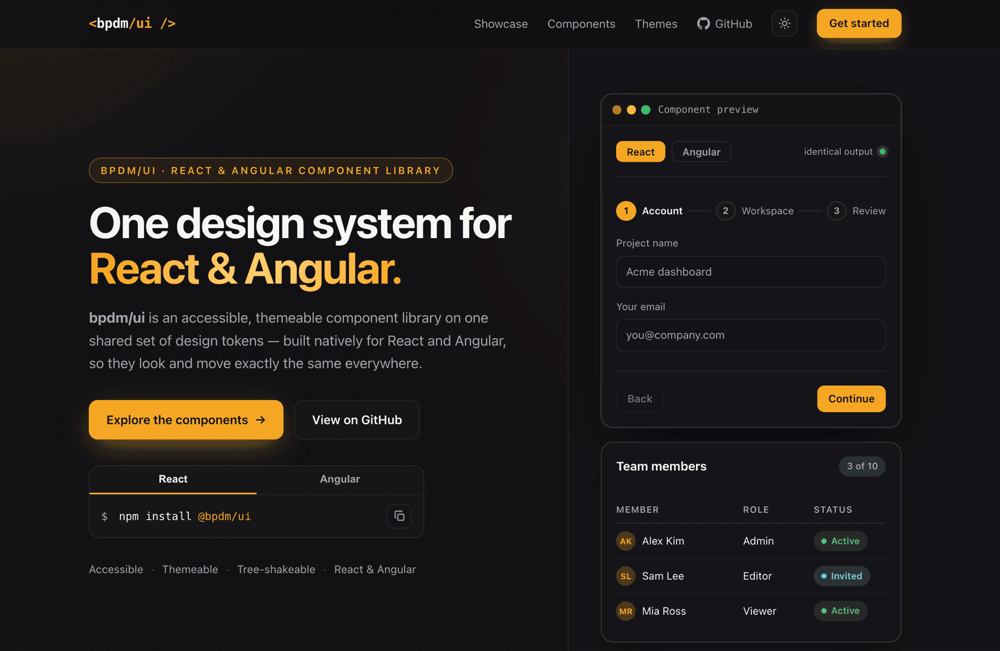

# bpdm/ui

[](https://www.npmjs.com/package/@bpdm/ui)
[](https://www.npmjs.com/package/@bpdm/ng)
[](https://tailwindcss.com)
[](#)
[](./LICENSE)

**One design system, every framework.** A modern, themeable, accessible component
library with a warm amber identity, four built-in themes and one consistent motion
language — implemented natively for **React and Angular** on top of a single shared
set of design tokens, so both frameworks look and behave identically.

**[Live site → ui.bpdm.dev](https://ui.bpdm.dev)**  ·  **[Docs → docs.ui.bpdm.dev](https://docs.ui.bpdm.dev)**



---

## Why bpdm/ui

- **React _and_ Angular from one token set** — the same 38 components, identical
  design and behaviour in both frameworks. Change a token once, both update. Most
  libraries pick a side; bpdm/ui ships both natively.
- **38 components per framework**, at full parity — inputs, selects, tree-select,
  data table, scheduler, dialogs, stepper, and more.
- **Four built-in themes** (`paper` · `mist` · `charcoal` · `slate`), a warm amber
  identity and one shared motion language, all driven by CSS-variable tokens.
- **Accessibility-minded** — components ship keyboard navigation, ARIA roles and
  screen-reader announcements; internationalized, with **RTL** support.
- **Typed and lean** — first-class TypeScript types, tree-shakeable ESM, built on
  Radix (React) and Angular CDK.

## Quick start

Install the package for your framework (both pull in the same shared tokens):

```bash
npm install @bpdm/ui     # React
npm install @bpdm/ng     # Angular  (also: npm install @angular/cdk@^21)
```

Then use a component:

```tsx
// React
import { Button } from '@bpdm/ui';

export function App() {
  return <Button>Get started</Button>;
}
```

```ts
// Angular
import { Component } from '@angular/core';
import { BpdmButton } from '@bpdm/ng';

@Component({
  selector: 'app-root',
  imports: [BpdmButton],
  template: `<button bpdmButton>Get started</button>`,
})
export class App {}
```

> bpdm/ui is built on **Tailwind CSS 4**. Your app needs Tailwind wired in and pointed
> at the packages, or components render unstyled — the two-minute setup is in the
> **[installation guide](https://docs.ui.bpdm.dev/docs/getting-started/installation)**.

## Packages

A monorepo (pnpm workspaces + Turborepo). Each framework is its own published package
under the `@bpdm/` scope, all sharing one tokens package — so you install only what you
use, and every framework looks identical.

| Package | Path | What | Status |
| --- | --- | --- | --- |
| [`@bpdm/tokens`](./packages/tokens) | `packages/tokens` | Framework-agnostic design tokens (CSS variables, four themes, motion) — the shared source of truth | ✅ Live |
| [`@bpdm/variants`](./packages/variants) | `packages/variants` | Framework-agnostic styling primitives (`cn` + cva variant maps) — shared class strings | ✅ Live |
| [`@bpdm/ui`](./packages/react) | `packages/react` | **React** components (Radix + Tailwind 4) — 38 components | ✅ Live |
| [`@bpdm/ng`](./packages/angular) | `packages/angular` | **Angular** components (standalone + Angular CDK + Tailwind 4) — 38 components, full parity with React | ✅ Live |

> There is no single "install both frameworks" package — that would ship code and peer
> dependencies you don't use. Separate scoped packages sharing `@bpdm/tokens` is the
> standard, lighter approach.

## Compatibility

Every package **requires Tailwind CSS 4** (the design tokens use Tailwind 4 syntax).
Framework support follows a **current + previous major** policy — older majors are
best-effort and only dropped in a minor release, noted in the changelog.

| Package | Framework support |
| --- | --- |
| `@bpdm/ui` (React) | React **18.x · 19.x** |
| `@bpdm/ng` (Angular) | Angular **21.x** (install a matching `@angular/cdk`) |

Each package's README has its full compatibility table.

---

## Local development

Everything runs from the repo root — Turborepo fans tasks out to the workspaces.
There is no root `dev` script; run an app or package directly with `--filter`.

```bash
pnpm install

# apps
pnpm --filter @bpdm/docs dev        # docs site       → http://localhost:8190
pnpm --filter @bpdm/landing dev     # landing         → http://localhost:8109

# React component playground (Storybook)
pnpm storybook                      # @bpdm/ui stories → http://localhost:8100

# repo-wide tasks (affected-scoped by Turborepo)
pnpm build          # build every package (tsup → ESM + CJS + d.ts; ng-packagr for Angular)
pnpm typecheck      # tsc --noEmit (strict)
pnpm lint           # ESLint across packages
pnpm test           # unit + a11y tests (Vitest)
```

Scope any command to one workspace with `pnpm --filter <name> <script>`
(e.g. `pnpm --filter @bpdm/ui test`).

## Repo structure

```
apps/
  docs/          # @bpdm/docs — Fumadocs documentation site (docs.ui.bpdm.dev)
  landing/       # @bpdm/landing — marketing landing + framework picker (ui.bpdm.dev)
packages/
  tokens/        # @bpdm/tokens — shared design tokens (CSS), source of truth
  variants/      # @bpdm/variants — shared cn + cva variant maps (pure TS)
  react/         # @bpdm/ui — the React library (see its own README)
  angular/       # @bpdm/ng — the Angular library (see its own README)
turbo.json         # Turborepo task pipeline
pnpm-workspace.yaml # workspace definition
```

Each app deploys as its own project: **`apps/landing` → ui.bpdm.dev** and
**`apps/docs` → docs.ui.bpdm.dev**.

## Contributing

Conventions, project structure, and how to add a component are in
[CONTRIBUTING.md](./CONTRIBUTING.md).

## License

[MIT](./LICENSE) © [bpdm](https://bpdm.dev)
